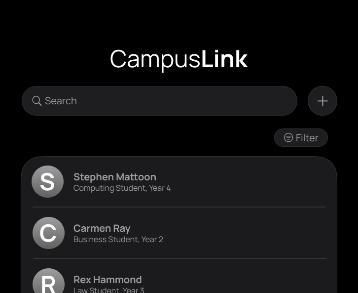

* This is **an address book project** designed for campus students and staff.  
  Example usages:
  * as a connecting tool among students taking the same course
  * for university professors to store information such as meeting venues
* For the detailed documentation of this project, see the **[CampusLink Product Website](https://ay2526s2-cs2103t-f12-2.github.io/tp)**.

**Acknowledgement**
* This project is based on the AddressBook-Level3 project created by the [SE-EDU initiative](https://se-education.org).