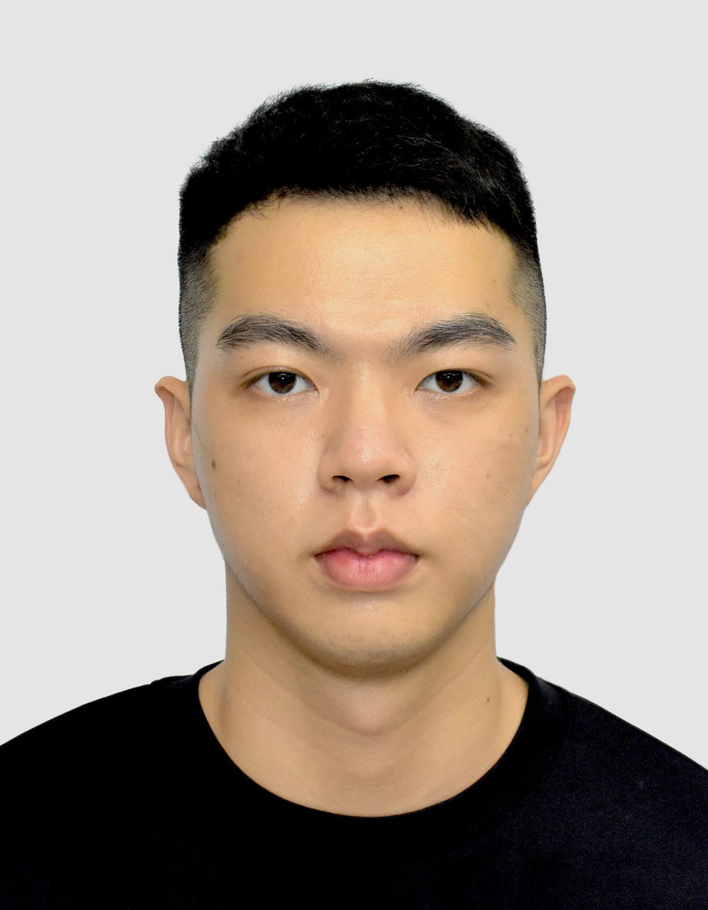

We are a team based in the [School of Computing, National University of Singapore](https://www.comp.nus.edu.sg).

You can reach us at the email `seer[at]comp.nus.edu.sg`

## Project team

### Supachod Trakansirorut (Art)

[[github](https://github.com/Spchdt)]

* Role: Developer

### Zheng Junwei 

[[github](https://github.com/junwezheng)]

* Role: Team Lead
* Responsibilities: UI

### ZhangKai

[[github](http://github.com/johndoe)] [[portfolio](team/johndoe.md)]

* Role: Developer
* Responsibilities: Data

### Zihan Li (Harry)

[[github](http://github.com/lzh201023)]

* Role: Developer
* Responsibilities: Dev Ops and Threading

